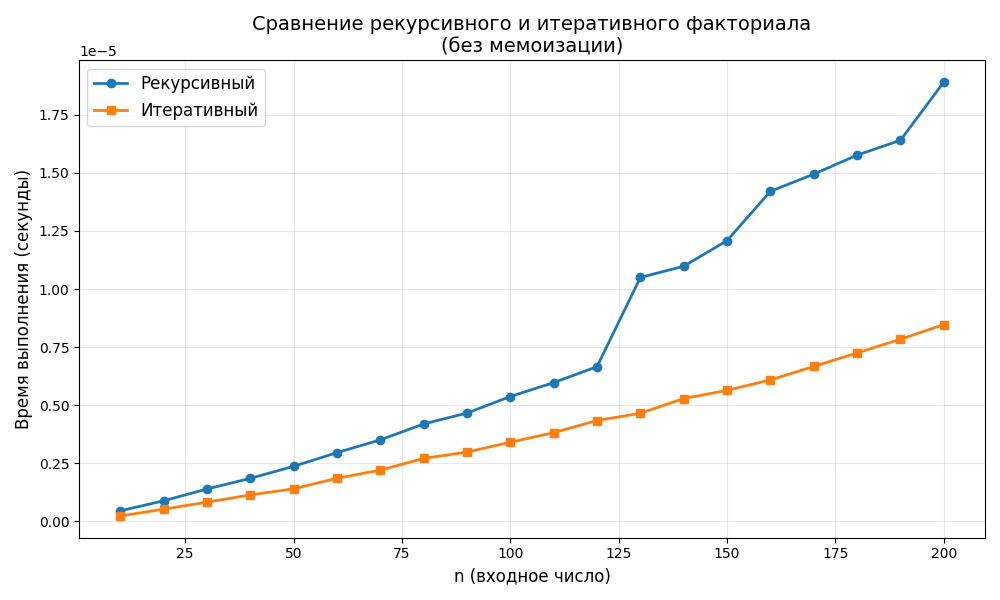
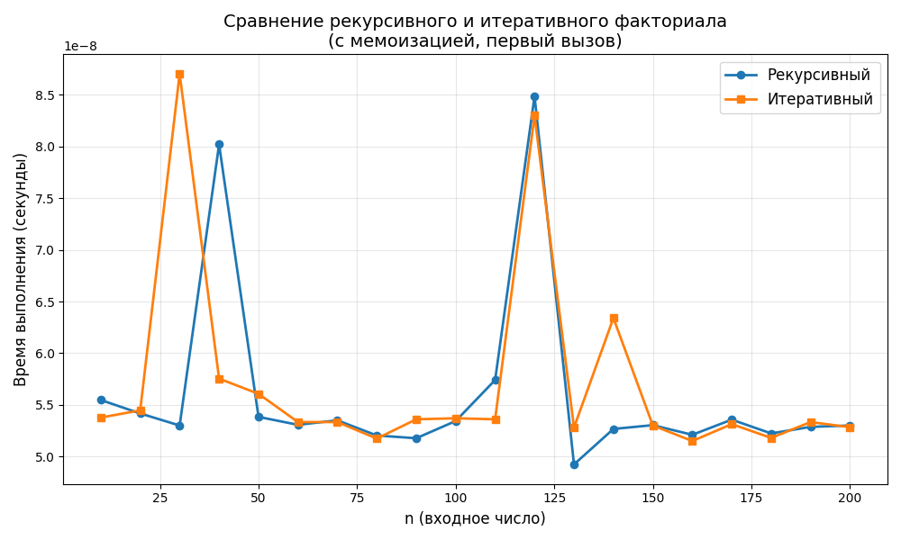
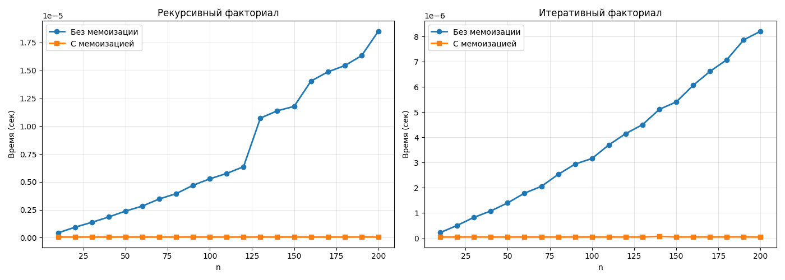

# Чащина Ксения Владимировна ИВТ-1.2

## Лабораторная работа № 5

_ _ _

### Задача  
Исследовать эффективность рекурсивного и итеративного подходов при вычислении факториала числа, а также оценить влияние мемоизации на производительность вычислений.

Реализовать четыре варианта функции вычисления факториала:
   - Рекурсивный без мемоизации
   - Рекурсивный с мемоизацией (`lru_cache`)
   - Итеративный без мемоизации
   - Итеративный с мемоизацией

Оценить ускорение, достигаемое за счет:
   - Использования итеративного подхода вместо рекурсивного
   - Применения мемоизации для каждого из подходов

Параметры тестирования

- Набор входных данных: `n = 10, 20, 30, ..., 200` (20 значений)
- Количество замеров для каждого n: `repeat = 5`
- Количество вызовов за замер: `number = 3000`
- Инструмент измерения: модуль `timeit` (минимальное время из серии замеров)
- Очистка кэша: перед каждым замером для мемоизированных функций выполнялась очистка кэша для измерения времени "холодного" запуска

_ _ _

### Результаты экспериментов

#### Графическое сравнение рекурсивного и итеративного подходов (без мемоизации)

**Анализ графика (Рисунок 1):**
- Итеративный подход стабильно показывает лучшее время выполнения при всех значениях `n`
- С ростом `n` разрыв во времени выполнения между подходами увеличивается
- Рекурсивный подход демонстрирует линейный рост времени выполнения, но с большим коэффициентом наклона

#### Графическое сравнение рекурсивного и итеративного подходов (с мемоизацией)

**Анализ графика (Рисунок 2):**
- При использовании мемоизации оба подхода показывают сопоставимые результаты
- Значения времени выполнения находятся на уровне `10⁻⁸` секунд, что значительно меньше, чем без мемоизации
- Итеративный подход сохраняет незначительное преимущество

#### Графическое представление влияния мемоизации на рекурсивный и итеративный подходы

**Анализ графика (Рисунок 3):**
- Мемоизация обеспечивает **колоссальное ускорение** рекурсивного подхода
- Время выполнения снижается с `~2·10⁻⁵` до `~5·10⁻⁸` секунд (ускорение ~357 раз для n=200)
- График с мемоизацией практически горизонтален (время не зависит от n после первого вызова)

**Анализ графика (Рисунок 4):**
- Мемоизация также ускоряет итеративный подход, но эффект менее выражен
- Итеративный подход без мемоизации уже достаточно эффективен
- Ускорение достигается за счет исключения повторных вычислений

#### Количественные результаты (для n = 200)

| Функция | Время выполнения (сек) | Относительное ускорение |
|---------|------------------------|------------------------|
| Рекурсивный (без мемо) | `1.85·10⁻⁵` | 1.0x (база) |
| Итеративный (без мемо) | `8.36·10⁻⁶` | **2.2x** |
| Рекурсивный (с мемо) | `5.19·10⁻⁸` | **356.7x** |
| Итеративный (с мемо) | `5.18·10⁻⁸` | **358.0x** |

_ _ _

### Выводы

#### Сравнение рекурсивного и итеративного подходов (без мемоизации)

**Итеративный подход эффективнее рекурсивного** по следующим причинам:
- Отсутствие накладных расходов на рекурсивные вызовы (сохранение контекста, адреса возврата)
- Линейная сложность O(n) с меньшей константой
- Экономия памяти стека вызовов

Ускорение итеративного подхода над рекурсивным: ~2.2x

#### Влияние мемоизации

**Мемоизация кардинально меняет ситуацию:**
- Для рекурсивного подхода ускорение достигает ~357 раз
- Это объясняется тем, что без мемоизации рекурсивная функция пересчитывает одни и те же значения множество раз
- С мемоизацией каждое значение вычисляется только один раз

